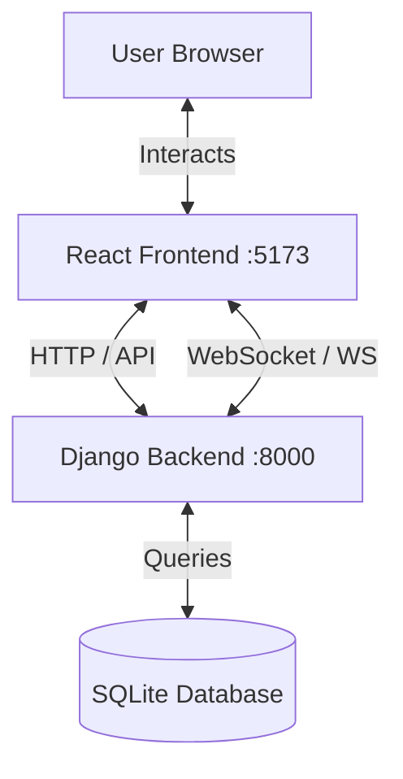

# TrueTalk.Ai Full Stack Architecture

This document details the separation between the Frontend (React) and Backend (Django) and explains precisely how they communicate.

## 🏗️ Architecture Overview

The application follows a **Decoupled Architecture**:
-   **Frontend**: A standalone React application (SPA) running on port `5173`.
-   **Backend**: A Django application running on port `8000`.
-   **Communication**: They talk via **HTTP Requests** (REST API) and **WebSockets** (Real-time).



---

## 🎨 Frontend (The Client)
**Location:** `ChatRoom/my-app/`
**Tech:** React, Vite, TailwindCSS

The frontend is responsible for the User Interface and State Management. It does **not** touch the database directly.

### Key Components & Responsibilities
| Component | Responsibility | Backend Link |
| :--- | :--- | :--- |
| **`LoginPage.jsx`** | Captures username. | `POST /api/chat/users/` (Creates/Gets User) |
| **`Sidebar.jsx`** | Lists users/groups. | `GET /api/chat/users/`, `GET /api/chat/groups/` |
| **`ChatWindow.jsx`** | Chat UI, Input. | **WebSocket** `ws://.../chat/<room>/` |

---

## ⚙️ Backend (The Server)
**Location:** `ChatRoom/` (Django App)
**Tech:** Django, Django Channels (Daphne), SQLite

The backend handles business logic, data storage, and real-time routing.

### Key Layers
1.  **Models (`models.py`)**: The Source of Truth.
    -   `User`, `Message`, `Group`.
2.  **API Views (`views.py`)**: Handles HTTP requests.
    -   Returns JSON data for the Sidebar and Login.
3.  **Consumers (`consumers.py`)**: Handles WebSockets.
    -   Manages live connections.
    -   Broadcasts messages to groups.

---

## 🔗 The Bridge: How They Connect

### 1. HTTP Link (REST API)
Used for **One-time Actions** (Login, Fetching Lists).

**Example: Logging In**
1.  **Frontend**: `LoginPage` sends `POST` request to `http://localhost:8000/api/chat/users/` with `{username: "Varun"}`.
2.  **Backend**: `UserViewSet` checks DB. If "Varun" exists, returns ID; else creates it.
3.  **Frontend**: Saves `username` to `localStorage` and redirects to Chat.

### 2. WebSocket Link (Real-Time)
Used for **Live Interaction** (Messaging, Read Receipts).

**Example: Sending a Message**
1.  **Frontend**: `ChatWindow` establishes a persistent connection:
    ```javascript
    new WebSocket('ws://localhost:8000/ws/chat/user_Varun_Rohan/')
    ```
2.  **Handshake**: Backend `routing.py` routes this to `ChatConsumer`.
3.  **Sending**: User types "Hello". Frontend sends JSON:
    ```json
    { "type": "chat_message", "message": "Hello", ... }
    ```
4.  **Processing**: `ChatConsumer.receive()`:
    -   Saves "Hello" to `Message` table in DB.
    -   Broadcasts the message to the "Room Group".
5.  **Receiving**:
    -   **Sender's Frontend**: Receives echo (confirms sent).
    -   **Receiver's Frontend**: Receives message -> Updates `messages` state -> UI shows bubble.

### 3. Read Receipts Flow (The "Blue Ticks")
1.  **Trigger**: Receiver opens the chat.
2.  **Frontend**: `ChatWindow` detects unread messages and sends:
    ```json
    { "type": "read_receipt", "message_id": 123 }
    ```
3.  **Backend**: `ChatConsumer` updates DB (`is_read=True`) and broadcasts event.
4.  **Sender's Frontend**: Receives `read_receipt` event -> Updates UI tick color to Blue.

---

## 📁 File-to-File Mapping

| Frontend File | Connects To | Backend File | Purpose |
| :--- | :---: | :--- | :--- |
| `LoginPage.jsx` | ➡️ | `views.py` (`UserViewSet`) | Authentication |
| `Sidebar.jsx` | ➡️ | `views.py` (`UserViewSet`, `MessageViewSet`) | Fetching Lists & Previews |
| `ChatWindow.jsx` | ↔️ | `consumers.py` (`ChatConsumer`) | Real-time Chat & Status |
| `App.jsx` | - | `urls.py` | Routing (Conceptually) |
